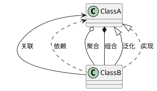

# UML类图

## 1 类

类（Class）是指具有相同属性、方法和关系的对象的抽象，它封装了数据和行为，是面向对象程序设计（OOP）的基础，具有封装性、继承性和多态性等三大特性。在 UML 中，类使用包含类名、属性和操作且带有分隔线的矩形来表示。

|可访问性|类图所表示的符号|
|--|--|
|public|+|
|private|-|
|protected|#|

## 2 类图

类图（ClassDiagram）是用来显示系统中的类、接口、协作以及它们之间的静态结构和关系的一种静态模型。

## 3 类之间的关系

### 3.1 依赖

依赖（Dependency）关系是一种使用关系，它是对象之间耦合度最弱的一种关联方式，是临时性的关联。

在 UML 类图中，***依赖关系使用带箭头的虚线来表示，箭头从使用类指向被依赖的类。***


示例:

```java
public class Oxygen {
}

public class Water {
}

/**
 * Oxygen 和 Water 不是以成员变量的方式，而是以形参的方式引入
 */
public class Animal {
	public void drink(Water water) {
	}

	public void breathe(Oxygen oxygen) {

	}
}
```

### 3.2 关联

关联（Association）关系是对象之间的一种引用关系，用于表示一类对象与另一类对象之间的联系，如老师和学生。

关联可以是双向的，也可以是单向的。在 UML 类图中，***双向的关联可以用带两个箭头或者没有箭头的实线来表示，单向的关联用带一个箭头的实线来表示，箭头从使用类指向被关联的类。***


示例:

```java
public class Climate {
}

/**
 * Climate 以成员变量的方式引入
 */
public class Penguin {
	private Climate climate;
}
```

### 3.3 聚合

聚合（Aggregation）关系是关联关系的一种，是强关联关系，是整体和部分之间的关系。部分可以脱离整体对象而独立存在，如雁群和大雁的关系，单个大雁离队了，但雁群依然存在。

在 UML 类图中，***聚合关系可以用带空心菱形的实线来表示，菱形指向整体。***


示例:

```java
public class WildGoose {
}

/**
 * 整体和部分是可以分割的
 *
 * 1. WildGoose 以成员变量的方式引入
 * 2. 以形参的方式，通过构造函数或 set 方法赋值 WildGoose 对象
 * 3. 因为 WildGoose 对象是从 WildGooses 类的外部传入的，所以 WildGoose 对象不会随着 WildGooses 对象的删除而删除
 */
public class WildGooses {
	private WildGoose wildGoose;

	public WildGooses(WildGoose wildGoose) {
		this.wildGoose = wildGoose;
	}

	public void setWildGoose(WildGoose wildGoose) {
		this.wildGoose = wildGoose;
	}
}
```

### 3.4 组合

组合（Composition）关系也是关联关系的一种，也表示类之间的整体与部分的关系，但它是一种更强的聚合关系。如公司和员工的关系，公司倒闭了，员工也就解散了。

在 UML 类图中，***组合关系用带实心菱形的实线来表示，菱形指向整体。***


示例:

```java
public class Wing {
}

/**
 * 整体和部分是不可分割的，它们有共同的生命周期
 *
 * 1. Wing 以成员变量的方式引入
 * 2. 在构造函数内部实例化 Wing 对象
 * 3. 因为 Wing 对象是在 Bird 类的内部实例化出来的，所以 Wing 对象会随着 Bird 对象的删除而删除
 */
public class Bird {
	private Wing wing;

	public Bird() {
		this.wing = new Wing();
	}
}
```

### 3.5 泛化

泛化（Generalization）关系是对象之间耦合度最大的一种关系，表示一般与特殊的关系，是父类与子类之间的关系，是一种继承关系。

在 UML 类图中，***泛化关系用带空心三角箭头的实线来表示，箭头从子类指向父类。***


示例:

```java
public class Animal {
}

/**
 * 泛化（继承）
 */
public class Bird extends Animal {
}
```

### 3.6 实现

实现（Realization）关系是接口与实现类之间的关系。

在 UML 类图中，实现关系使用带空心三角箭头的虚线来表示，箭头从实现类指向接口。


示例:

```java
public interface Fly {

}

/**
 * 实现
 */
public class WildGoose implements Fly {
}
```

### 3.7 综合应用


### 3.8 PlantUML 类图


